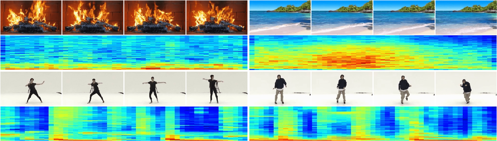
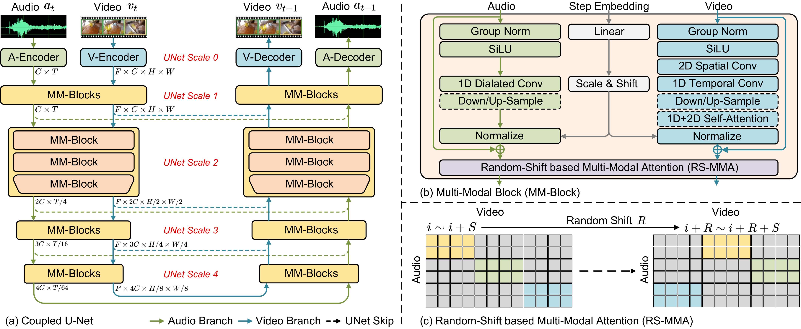

# MM-Diffusion（CVPR 2023）
This is the official PyTorch implementation of the paper [MM-Diffusion: Learning Multi-Modal Diffusion Models for Joint Audio and Video Generation](https://arxiv.org/abs/2212.09478), which is accpted by CVPR 2023.
 
## Contents
- [MM-Diffusion（CVPR 2023）](#mm-diffusioncvpr-2023)
  - [Contents](#contents)
  - [Introduction](#introduction)
    - [Overview](#overview)
    - [Visual](#visual)
  - [Requirements and dependencies](#requirements-and-dependencies)
  - [Models](#models)
  - [Datasets](#datasets)
  - [Test](#test)
  - [Train](#train)
  - [Conditional Generation](#conditional-generation)
  - [Related projects](#related-projects)
  - [Citation](#citation)
  - [Contact](#contact)
  
## Introduction
We propose the first joint audio-video generation framework named MM-Diffusion that brings engaging watching and listening experiences simultaneously, towards high-quality realistic videos.  MM-Diffusion consists of a sequential multi-modal U-Net. Two subnets for audio and video learn to gradually generate aligned audio-video pairs from Gaussian noises.




### Overview



### Visual
The generated audio-video examples on landscape:

https://user-images.githubusercontent.com/105475691/207589456-52914a01-1175-4f77-b8f5-112d97013f7c.mp4

The generated audio-video examples on AIST++:

https://user-images.githubusercontent.com/105475691/207589611-fe300424-e5e6-4379-a917-d9a07e9dd8fb.mp4

The generated audio-video examples on Audioset:

https://user-images.githubusercontent.com/105475691/207589639-0a371435-f207-4ff4-a78e-3e9c0868d523.mp4

## Requirements and dependencies
* python 3.8 (recommend to use [Anaconda](https://www.anaconda.com/))
* pytorch >= 1.11.0
```
git clone https://github.com/researchmm/MM-Diffusion.git
cd MM-Diffusion

conda create -n mmdiffusion python=3.8
conda activate mmdiffusion
conda install pytorch torchvision torchaudio pytorch-cuda=11.6 -c pytorch-nightly -c nvidia
conda install mpi4py
pip install -r reqirements.txt
```
## Models
Pre-trained models can be downloaded from [google drive](https://drive.google.com/drive/folders/1Mno4A3BUXELAdX4m650CJ1VfuMVlkz5p?usp=share_link), and [baidu cloud](https://pan.baidu.com/s/1vJIZCHBVlmcq9np1ytstbQ?pwd=vqon).
* *Landscape.pt*: trained on landscape dataset to generate audio-video pairs.
* *Landscape_SR.pt*: trained on landscape dataset to upsample frame from reolution 64x64 to 256x256.
* *AIST++.pt*: trained on AIST++ dataset to generate audio-video pairs.
* *AIST++_SR.pt*: trained on AIST++ dataset to upsample frame from reolution 64x64 to 256x256.
* *guided-diffusion_64_256_upsampler.pt*: from [guided-diffusion](https://github.com/openai/guided-diffusion), used as initialization of image SR model. 

* *i3d_pretrained_400.pt*: model for evaluting videos' FVD and KVD, Manually download to  ```~/.cache/mmdiffusion/``` if the automatic download procedure fails. 
* *AudioCLIP-Full-Training.pt*: model for evaluting audios; FAD, Manually download to  ```~/.cache/mmdiffusion/``` if the automatic download procedure fails.

<!-- The output results(sampled with full ddpm) on Landscape, AIST++ can be downloaded from [google drive](), and [baidu cloud]()().
 -->

## Datasets
1. Landscape
2. AIST++_crop

The datasets can be downloaded from [google drive](https://drive.google.com/drive/folders/14A1zaQI5EfShlv3QirgCGeNFzZBzQ3lq?usp=sharing), and [baidu cloud](https://pan.baidu.com/s/1CRUSpUzdATIN7Jt8aNDaUw?pwd=fec8). \
We only use the training set for training and evaluation.

You can also run our script on your own dataset by providing the directory path with relevant videos, and the script will capture all videos under the path, regardless of how they are organized. 

## Test

1. Download the pre-trained checkpoints.
2. Download the datasets: Landscape or AIST++_crop.
3. Modify relative pathes and run generation scripts to generate audio-video pairs.
```
bash ssh_scripts/multimodal_sample_sr.sh
```
4. Modify `REF_DIR`, `SAMPLE_DIR`, `OUTPUT_DIR` and run evaluation scripts.
```
bash ssh_scripts/multimodal_eval.sh
```

## Train

1. Prepare training datasets: Landscape or AIST++_crop.
2. Download datasets: Landscape or AIST++_crop
```
# Traning Base model
bash ssh_scripts/multimodal_train.sh

# Training Upsampler from 64x64 -> 256x256, first extract videos into frames for SR training, 
bash ssh_scripts/image_sr_train.sh
```

## Conditional Generation
```
# zero-shot conditional generation: audio-to-video
bash ssh_scripts/audio2video_sample_sr.sh

# zero-shot conditional generation: audio-to-video
bash ssh_scripts/video2audio_sample.sh
```
## Related projects
We also sincerely recommend some other excellent works related to us. :sparkles: 
* [Diffusion Models Beat GANS on Image Synthesis](https://github.com/openai/guided-diffusion)
* [AudioCLIP: Extending CLIP to Image, Text and Audio](https://github.com/AndreyGuzhov/AudioCLIP)
* [DPM-Solver: A Fast ODE Solver for Diffusion Probabilistic Model Sampling in Around 10 Steps](https://github.com/LuChengTHU/dpm-solver)
  
## Citation
If you find our work useful for your research, please consider citing our paper. :blush:
```
@inproceedings{ruan2022mmdiffusion,
author = {Ruan, Ludan and Ma, Yiyang and Yang, Huan and He, Huiguo and Liu, Bei and Fu, Jianlong and Yuan, Nicholas Jing and Jin, Qin and Guo, Baining},
title = {MM-Diffusion: Learning Multi-Modal Diffusion Models for Joint Audio and Video Generation},
year	= {2023},
booktitle	= {CVPR},
}
```

## Contact
If you meet any problems, please describe them in issues or contact:
* Ludan Ruan: <ruanld@ruc.edu.cn> 
* Huan Yang: <huayan@microsoft.com>
